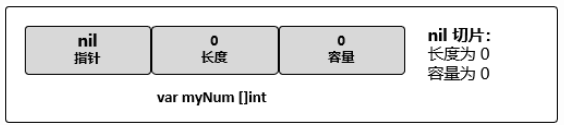
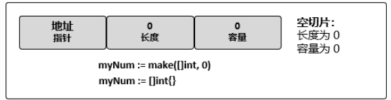
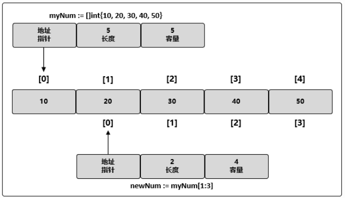

## 切片

>   Golang的数组是定长的，但是很多情况下，我们需要一个变长的数组，所以切片的概念应运而生。可以把程序的内存想象成一个超大的底层数组，切片就像一种带范围的指针，这个指针只能访问范围内的元素，并且切片的范围也是可以修改的，这两种特性使切片可以被当成动态数组来使用。切片的实质是一个很小的结构体对象，它有三个字段（1：指向底层数组的指针，2：切片访问的元素的个数，3：切片的容量）  

```go
var 切片名 []type => var slice []int   //和数组类似，只是不需要指定[]运算符里的值
```


## 切片的创建和初始化

-   ##### 利用数组创建切片（显示数组）

    ```go
    var arr [5]int = [5]int{1,2,3,4,5} 
    var slice []int = arr[1:3]           //长度为2，容量为4
    ```

-   #####  make函数（隐式数组）

    ```go
    slice := make([]int, 5)     	//指定长度和容量都为5
    slice := make([]int, 5, 10)   	//指定长度为5，容量为10，Golang不允许创建容量小于长度的切片
    ```
    
-   #####  字面量创建切片（隐式数组），切片的长度和容量会基于初始化时提供的元素个数确定。

    ```go
    mystr := []string{"jack", "mark", "nick"}   //长度和容量都是3
    mystr := []int{10, 20, 30, 40}       		//长度和容量都是4
    mystr := []string{99:""}             		//长度和容量都是100
    ```
    
    

## nil切片

>   需要描述一个不存在的切片时，nil切片会很好用。
>



## 空切片

>   底层数组中包含0个元素，也没有分配任何存储空间。
>




## 为切片中的元素赋值

>   对切片里某个索引指向的元素赋值和对数组里某个索引指向的元素赋值的方法完全一样，使用[]操作符。

```go
myNum := []int{10, 20, 30, 40, 50} // 创建一个整型切片，其容量和长度都是 5 个元素
myNum [1] = 25           // 改变索引为 1 的元素的值
```

 

## 通过切片创建新的切片

>   利用切片a创建切片b时（两个切片a、b共享一个底层数组），切片b的起始位置与a有关，切片b的容量和a没有关系，他们的容量只和底层数组的长度有关。所有切片的起始位置换算到底层数组上面时，长度和容量都不能超过底层数组的长度。

```go
myNum := []int{10, 20, 30, 40, 50, 60, 70, 80, 90}
newNum := myNum[3:5]          //起始位置对应底层数组的40，长度为2，容量为6
newNum2 := newNum[1:6]        //起始位置对应底层数组的50，长度为5，容量为5
newNum2[3] = 0

fmt.Println(myNum)            //[10 20 30 40 50 60 70 0 90]
fmt.Println(newNum)           //[40 50]
fmt.Println(newNum2)          //[50 60 70 0 90]
```

>   slice[i:j:k] 其中i表示从slice的第几个元素开始切，j控制切片的长度(j-i)，k控制切片的容量(k-i)，如果没有给定k，则表示切到底层数组的最尾部。
>




## 切片扩容

>   使用内置的append函数，传入一个被操作的切片和一些追加值，返回一个新的切片；append函数一定会增加新切片的长度，但是容量是否改变取决于被操作切片的可用容量；如果被操作切片的可用容量足够，当切片的容量小于1000时，容量会成倍增加，当切片的容量超过1000，增量因子会设为1.25；如果被操作切片的可用容量不足，那么系统会复制一份底层数组并扩大这个底层数组的长度，重新生成切片；

```go
myNum := []int{10, 20, 30, 40, 50, 60, 70, 80, 90}
newNum := myNum[3:5]
newNum2 := newNum[1:6]
newNum2[3] = 0

newNum3 := newNum2[1:5]
newNum3 = append(newNum3, 100)      //扩容，此时底层数组复制，增长，在元素90后面加上100，重新生成切片

fmt.Println(myNum)            //[10 20 30 40 50 60 70 0 90]
fmt.Println(newNum)           //[40 50]
fmt.Println(cap(newNum))
fmt.Println(newNum2)           //[50 60 70 0 90]
fmt.Println(cap(newNum2))
fmt.Println(newNum3)           //[60 70 0 90 100]
```

 

## 切片间的拷贝操作

>   **func copy(dst, src []Type) int** 它表示把切片 **src** 中的元素拷贝到切片 **dst** 中，返回值为拷贝成功的元素个数。如果     **src** 比 **dst** 长，就截断；如果 **src** 比 **dst** 短，则只拷贝 **src** 那部分：

```go
num1 := []int{10, 20, 30}
num2 := make([]int, 5)
count := copy(num2, num1)
fmt.Println(count)    //3
fmt.Println(num2)    //[10 20 30 0 0]
```

